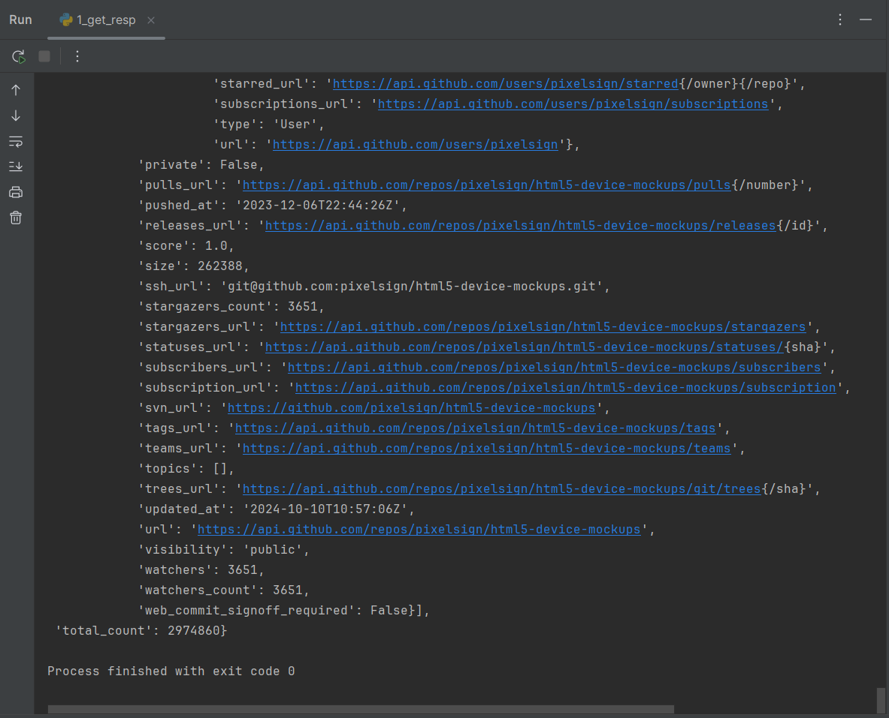
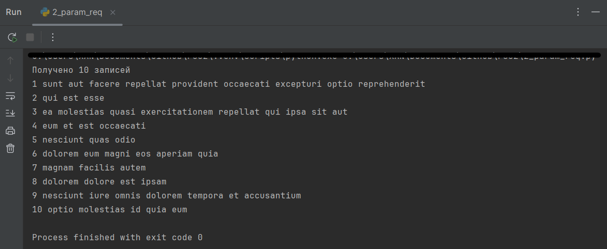
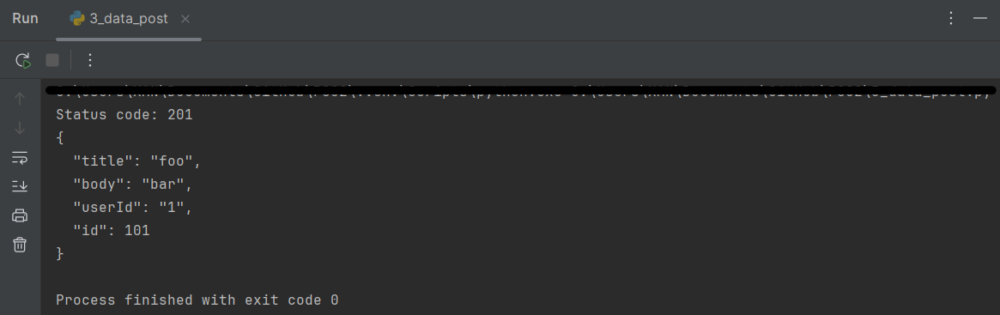

## PS02 "Основы работы с библиотекой Requests"
В данном репозитории содержатся выполненные задания, связанные с работой с API, отправкой GET и POST-запросов, а также с использованием URL-параметров для фильтрации данных.

### Задание 1: (1_get_resp.py) отработка получение данных

### Задание 2: (2_param_req.py) отработка выставления параметров запроса

### Задание 3: (3_data_post.py) отработка отправки данных

Все задания успешно выполнены и представлены в этом репозитории.